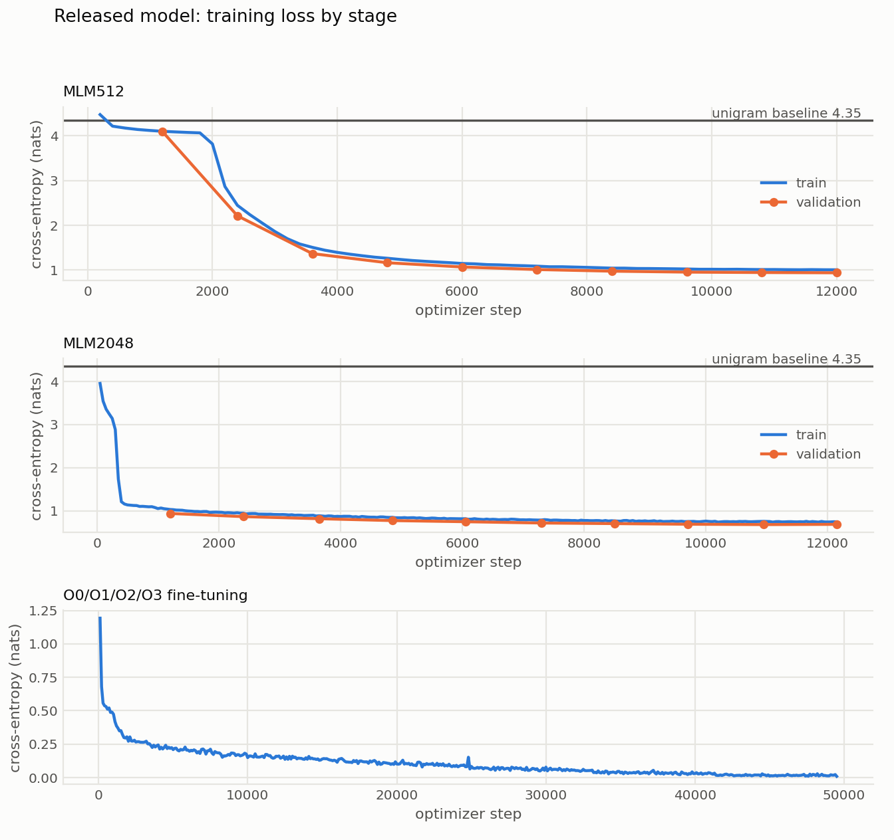

# Measured results

This page is the single record of the results measured with the repository's
selected configurations. It reports observed values only. Exact arguments and
machine-readable result files are committed under `reports/runs/`; detailed
tables are under `reports/tables/best/`.

## Evaluation setup

| item | value |
|---|---|
| corpus | BinKit x86_64 |
| split | grouped by program: 47 test programs and 28 validation programs |
| O2/O3 test set | 55,657 windows |
| O0/O1/O2/O3 test set | 116,321 windows from 376 binaries |
| narrow input | 512 bytes, stride 512 bytes |
| wide input | 2048 bytes, stride 512 bytes |
| 16.9 KB aperture | mean probability over the target window and 16 neighbours on each side |
| released-model hardware | 1× NVIDIA A100 80 GB, bf16; 8 CPU cores; 64 GB system memory |
| recorded software | Python 3.12.11, PyTorch 2.8.0, Transformers 4.55.4, NumPy 2.3.3 |

Sequence accuracy scores every 512-byte target window. Binary accuracy combines
all window probabilities belonging to the same binary. The 2048-byte encoder
therefore reads overlapping context while preserving the 512-byte evaluation
unit.

## Results

| configuration | evaluation | measured result |
|---|---|---:|
| released `opt4_wide_seed29` model | O0/O1/O2/O3, sequence accuracy | **84.23%** |
| released `opt4_wide_seed29` model | O0/O1/O2/O3, balanced sequence accuracy | **83.10%** |
| released `opt4_wide_seed29` model | O0/O1/O2/O3, binary soft-vote accuracy | **93.88%** |
| 7-model wide ensemble | O2/O3, 512-byte sequence accuracy | **75.10%** |
| same 7-model ensemble | O2/O3, 16.9 KB aperture sequence accuracy | **81.10%** |
| three wide seeds | O2/O3, mean 512-byte sequence accuracy | **71.98%** (SD 0.68 pp) |
| 6-model narrow+wide ensemble | O0/O1/O2/O3, 16.9 KB aperture sequence accuracy | **87.62%** |
| three wide seeds | O0/O1/O2/O3, binary soft-vote accuracy | **95.21%** |

The released model was trained end to end and evaluated from its saved
checkpoint. The selected fine-tuning epoch was epoch 4 of 6, with 77.61%
validation accuracy. The complete MLM512 → MLM2048 → fine-tuning → evaluation →
export pipeline took 12:42:09.

The ensemble measurements use the saved per-window probabilities and canonical
corpus. Their exact member lists are recorded below.

## Training loss



The panels show the three consecutive stages used to train the released model.
Blue lines are interval-averaged training loss; orange points are validation
loss measured after each MLM epoch. Fine-tuning selected its checkpoint by
validation accuracy, so that stage records training loss only. Each panel has
its own vertical scale because masked-byte pre-training and four-class
fine-tuning optimize different objectives.

## Configuration membership

The O2/O3 7-model ensemble uses:

- `r4_ctx2048_dense`
- `r6_dense2048_seed7`, `r6_dense2048_seed13`, `r6_dense2048_seed29`
- `r7_wide2048_seed7`, `r7_wide2048_seed13`, `r7_wide2048_seed29`

All seven use a 2048-byte encoder at stride 512. The `r4` and `r6` runs initialize
from the 512-byte MLM with tiled position embeddings. The `r7` runs initialize
from the continued 2048-byte MLM. The 71.98% measurement is the mean of the three
`r7` seeds.

The O0/O1/O2/O3 6-model ensemble uses:

- `r9_opt4_base_seed7`, `r9_opt4_base_seed13`, `r9_opt4_base_seed29`
- `r9_opt4_wide_seed7`, `r9_opt4_wide_seed13`, `r9_opt4_wide_seed29`

The 87.62% measurement combines all six models at the 16.9 KB aperture. The
95.21% binary measurement uses the three wide models only.

## Evidence

| evidence | location |
|---|---|
| released model arguments, metrics, hardware, pipeline timestamps, and training trace | [`reports/runs/release/opt4_wide_seed29/`](../reports/runs/release/opt4_wide_seed29/) |
| exact arguments and result JSON for the 13 ensemble members | [`reports/runs/best/`](../reports/runs/best/) |
| detailed result tables | [`reports/tables/best/`](../reports/tables/best/) |
| exact program split | [`reports/tables/split_programs.txt`](../reports/tables/split_programs.txt) |
| machine-readable configuration map | [`configs/best_results.json`](../configs/best_results.json) |
| released model weights | [XuViewer/binprov](https://huggingface.co/XuViewer/binprov) |

## Reproduction

Inspect a complete plan without writing files:

```bash
python scripts/run_best.py --list
python scripts/run_best.py --group o2o3_7wide_16.9KB
python scripts/run_best.py --group opt4_6run_16.9KB
```

After preparing the corpus, add `--execute` to train and evaluate. The CUDA
profile used for the released single model is `configs/gpu_release.json`.
Generated checkpoints, probabilities, and exports are written under ignored
`results/` directories rather than committed to Git.

Repeated training can vary by roughly 1–2 percentage points with the seed and
software environment. Compare multi-seed distributions when assessing a new
configuration.
